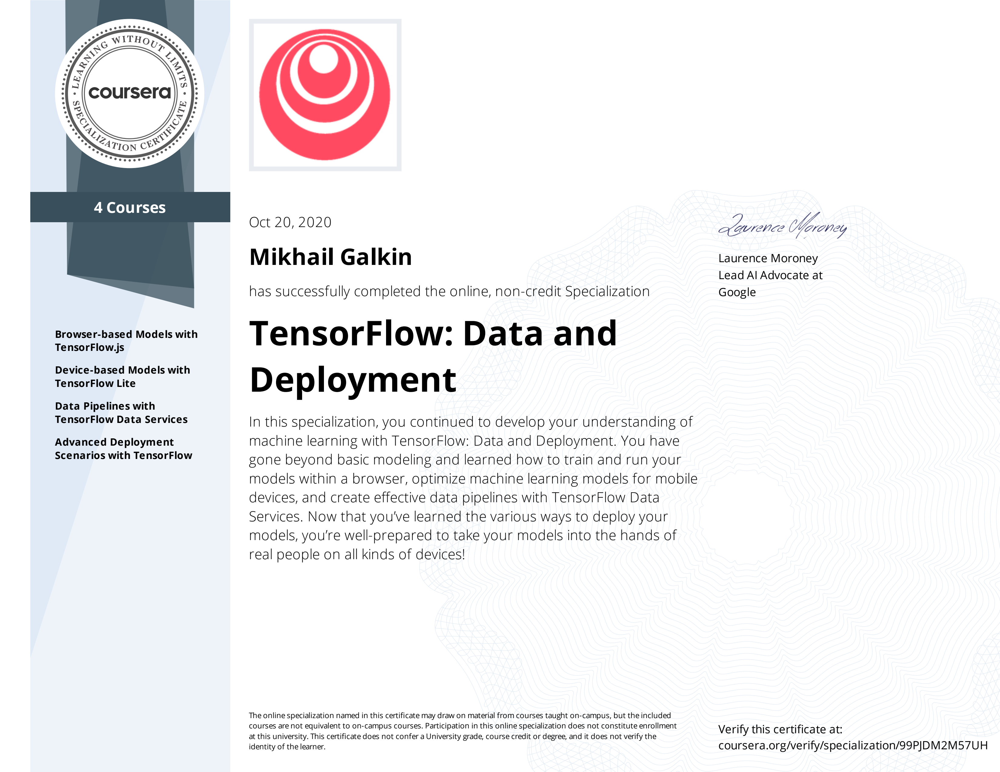

#### This repository contains working notebooks on [Specialization](https://www.deeplearning.ai/program/tensorflow-data-and-deployment-specialization/) offered by [DeepLearning.ai](https://deeplearning.ai) through Coursera.

There are 4 Courses in this Specialization:
1. [Browser-based Models with TensorFlow.js](https://www.coursera.org/account/accomplishments/verify/HV83EPH4RSVL).
2. [Device-based Models with TensorFlow Lite](https://www.coursera.org/account/accomplishments/verify/DFXPBRNSGWJJ).
3. [Data Pipelines with TensorFlow Data Services](https://www.coursera.org/account/accomplishments/verify/DZV7Y2773W4T).
4. [Advanced Deployment Scenarios with TensorFlow](https://www.coursera.org/account/accomplishments/verify/WFD3C6TGYWS6).

#### Specialization Certificate
I've successfully completed all courses at the specialization and earned my [certificate](https://www.coursera.org/account/accomplishments/specialization/99PJDM2M57UH).

